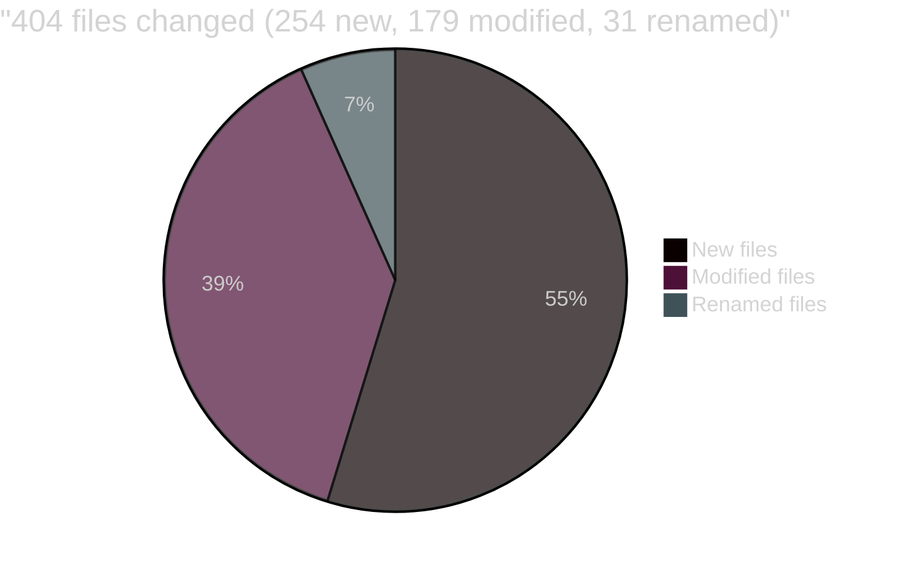
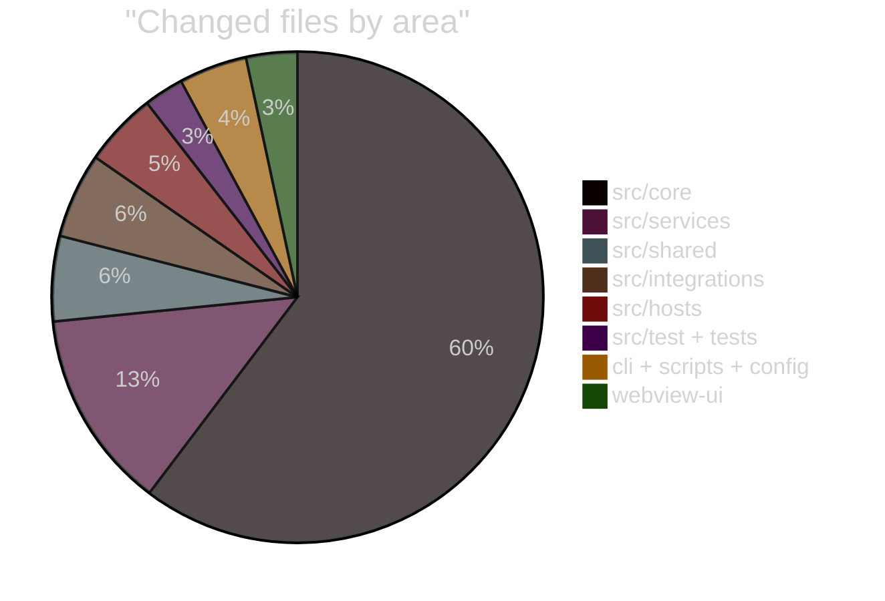
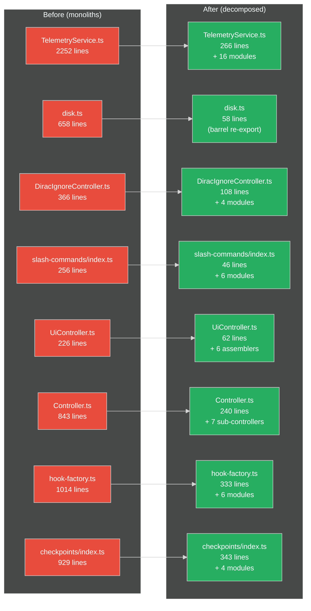
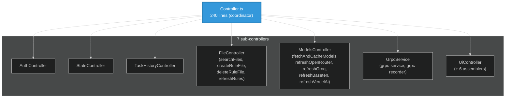
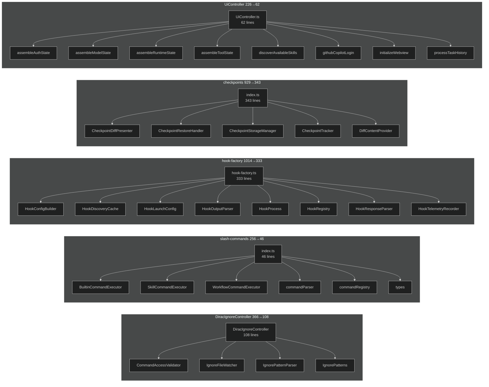
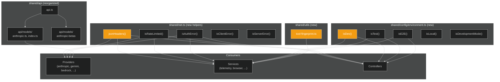
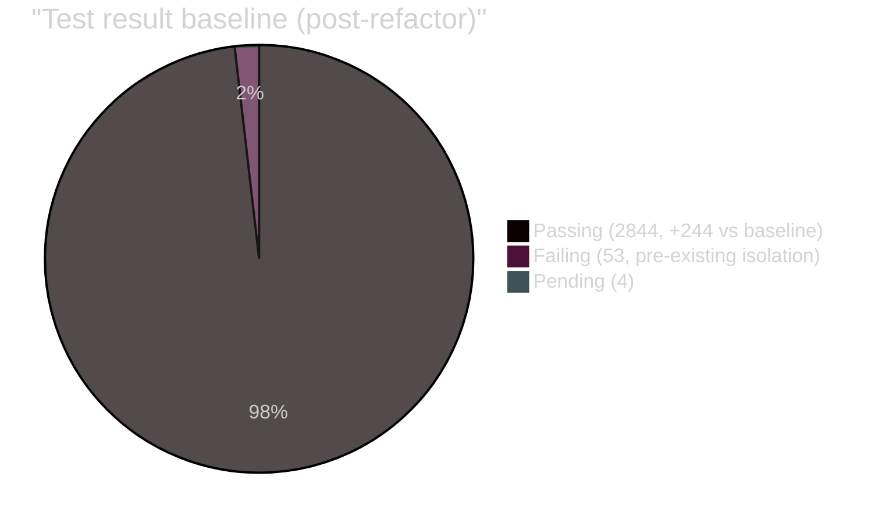
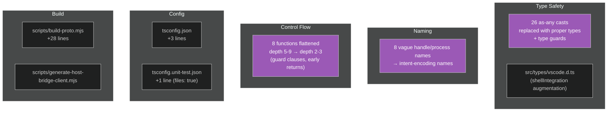

# Refactoring Documentation: `1d316d3` → HEAD

**49 commits** | **406 files changed** | **+58,163 / -30,328 lines** | **158 new production files** | **71 new test files**

---

## Why

The codebase had accumulated god classes, layer violations, duplicated logic, and vague naming that violated the engineering principles in `AGENTS.md`. The refactoring centralized shared utilities, decomposed god classes into SRP-focused modules, flattened deeply nested control flow, and added characterization tests to lock in behavior before restructuring.

---

## Architecture Diagram (Before → After)

```
BEFORE                                    AFTER
═══════════════════════════════════════════════════════════════════════
                                          ┌──────────────┐
[Controller.ts]                           │ AuthController│
  1500+ lines                             │ WorkspaceCtrl│
  - auth logic        ──────────────►     │ TaskController│
  - workspace mgmt                        │ StateController│
  - task mgmt                             │ UiController   │
  - state mgmt                            │ TaskHistoryCtrl│
  - UI mgmt                               │ Initializer    │
  - task history                          └──────────────┘
                                          
[TelemetryService.ts]                     ┌──────────────────┐
  2252 lines          ──────────────►     │ TelemetryService │ 289
  - event emission                        │ EventEmitter     │
  - metrics                               │ Metrics          │
  - session tracking                      │ SessionTracker   │
  - provider mgmt                         │ ProviderManager  │
  - types                                 │ Types/Events     │
  - 90 capture methods                    │ BrowserTelemetry │
                                          │ HookTelemetry    │
                                          │ MentionTelemetry │
                                          │ SubagentTelemetry│
                                          │ TaskTelemetry    │
                                          │ TerminalTelemetry│
                                          │ ToolTelemetry    │
                                          │ UiTelemetry      │
                                          │ UserTelemetry    │
                                          │ WorkspaceTelemetry│
                                          └──────────────────┘

[hook-factory.ts]                        ┌──────────────────┐
  1014 lines          ──────────────►     │ hook-factory     │ 333
  - config building                       │ HookConfigBuilder│
  - launch config                         │ HookLaunchConfig │
  - output parsing                        │ HookOutputParser │
  - response parsing                      │ HookResponseParser│
  - telemetry                             │ HookTelemetryRecorder│
  - registry                              │ HookRegistry     │
                                          └──────────────────┘

[Checkpoints/index.ts]                   ┌──────────────────┐
  929 lines           ──────────────►     │ index.ts         │ 343
  - diff content                          │ DiffContentProvider│
  - diff presenter                        │ DiffPresenter    │
  - storage mgmt                          │ StorageManager   │
  - restore handling                      │ RestoreHandler   │
                                          └──────────────────┘

[BrowserSession.ts]                      ┌──────────────────┐
  602 lines           ──────────────►     │ BrowserSession   │ 260
  - connection mgmt                       │ ConnectionManager│
                                          └──────────────────┘

[StandaloneTerminalManager.ts]           ┌──────────────────┐
  618 lines           ──────────────►     │ StandaloneTerm.. │ 297
  - process mgmt                          │ TerminalProcess..│
                                          └──────────────────┘

[disk.ts]                                ┌──────────────────┐
  689 lines           ──────────────►     │ disk.ts (barrel) │ 58
  - 48 functions in                      │ atomicWrite      │
    one file                              │ conversationHist │
                                          │ directoryEnsurers│
                                          │ environmentMeta  │
                                          │ fileNames        │
                                          │ globalStorageDir │
                                          │ hooksStorage     │
                                          │ paths            │
                                          │ remoteConfigCache│
                                          │ skillsStorage    │
                                          │ taskHistory      │
                                          │ taskStorage      │
                                          └──────────────────┘
```

---

## Phase Breakdown

| Phase | Focus | Key Changes |
|-------|-------|-------------|
| **Phase 0** | Traceability & characterization tests | 70 baseline tests for Controller + Task; `WatcherFactory` DI for chokidar |
| **Phase 1** | Centralize shared utilities | `jsonHeaders()`, `isAuthError()`, `isRateLimited()`, test model IDs, beta flags, env checks, `resolveModeConfig()` |
| **Phase 2** | Fix layer boundaries | Move `ToolResponse` + `formatResponse` out of task loop and prompts; delegate decomposition; bedrock config consolidation |
| **Phase 3** | Controller decomposition | `Controller.ts` → 7 focused controllers; `DiffViewProvider` → 3 managers; `VscodeTerminalManager` → 138 lines; `CommandOrchestrator` → 275 lines |
| **Phase 4** | Rename vague methods | `handle`/`process`/`manage` → intent-encoding names |
| **Phase 5** | DRY HTTP headers | 15 inline `Content-Type` headers → `jsonHeaders()` |
| **Phase 7.1** | Flatten minimax.ts | Depth 7 → 3 |
| **Phase 8.1** | Extract TelemetryContextManager | From TelemetryService |
| **Agent 1** | API providers + transform | 13 provider handlers typed + tested; 6 transform format tests; stream-event tests for anthropic + claude-code |
| **Agent 2** | Task system decomposition | `Task` → `TaskApiErrorHandler`, `TaskRequestBuilder`, `TaskStreamAccumulator`, `ReasoningHandler`, `ToolUseHandler`, response presenters |
| **Agent 3** | Services + hooks + infra | TelemetryService, BannerService, BrowserSession, StandaloneTerminalManager, hook-factory, CheckpointTracker, CommandPermissionController all decomposed |
| **Agent 4** | Controller + models + DRY | `fetchAndCacheModels` shared utility; mentions/slash-commands/disk/UiController/initializeWebview/mergeWorktree/searchFiles flattened; DiracIgnoreController methods renamed |
| **Post-review fixes** | Code review findings | Timer leaks, race conditions, missing `dispose()`, `as any` casts, vague names, defensive programming |
| **Phase 6** | Finish god-class decomposition | 7 remaining partially-decomposed files fully split: TelemetryService 1704→289, disk.ts 689→58, DiracIgnoreController 352→108, slash-commands 278→46, UiController 226→62, updateSettings 202→46, updateSettingsCli 220→82. disk.ts barrel switched to `export const` pattern to fix sinon stub regression (+17 tests recovered) |

---

## God Classes Decomposed

### Fully Decomposed (now SRP-compliant)

| File | Before | After | Reduction | Extracted Modules |
|------|--------|-------|-----------|-------------------|
| `hook-factory.ts` | 1014 | 333 | -67% | HookConfigBuilder, HookLaunchConfig, HookOutputParser, HookResponseParser, HookTelemetryRecorder, HookRegistry |
| `Checkpoints/index.ts` | 929 | 343 | -63% | DiffContentProvider, DiffPresenter, StorageManager, RestoreHandler |
| `BrowserSession.ts` | 602 | 260 | -57% | BrowserConnectionManager |
| `CommandPermissionController.ts` | 610 | 277 | -55% | CommandParser, DangerousCharDetector, PermissionRuleEvaluator |
| `BannerService.ts` | 448 | 133 | -70% | RemoteBannerService, WelcomeBannerService |
| `mentions/index.ts` | 455 | 80 | -82% | file-mention, keyword-mention, url-mention, mention-parsers |
| `mergeWorktree.ts` | 215 | 75 | -65% | `result()` helper, guard clauses |
| `searchFiles.ts` | 148 | 18 | -88% | searchFilesHelpers |
| `updateTaskSettings.ts` | 144 | 89 | -38% | Helper extraction |
| `initializeWebview.ts` | 214 | 117 | -45% | Helper extraction |
| `StandaloneTerminalManager.ts` | 618 | 297 | -52% | TerminalProcessManager |
| `TelemetryService.ts` | 2252 | 289 | -87% | EventEmitter, Metrics, SessionTracker, ProviderManager, ProviderFactory, ContextManager, CategoryGate, BrowserTelemetry, HookTelemetry, MentionTelemetry, SubagentTelemetry, TaskTelemetry, TerminalTelemetry, ToolTelemetry, UiTelemetry, UserTelemetry, WorkspaceTelemetry |
| `disk.ts` | 689 | 58 | -92% | atomicWrite, conversationHistory, conversationHistoryFiles, directoryEnsurers, environmentMetadata, fileNames, globalStorageDir, hooksStorage, paths, remoteConfigCache, skillsStorage, taskHistory, taskStorage |
| `DiracIgnoreController.ts` | 366 | 108 | -70% | IgnorePatterns, IgnorePatternParser, IgnoreFileWatcher, CommandAccessValidator |
| `slash-commands/index.ts` | 278 | 46 | -83% | types, commandRegistry, commandParser, BuiltinCommandExecutor, WorkflowCommandExecutor, SkillCommandExecutor |
| `UiController.ts` | 226 | 62 | -73% | assembleModelState, assembleAuthState, assembleRuntimeState, assembleToolState, discoverAvailableSkills, processTaskHistory |
| `updateSettings.ts` | 280 | 46 | -84% | settingsApiConfig, settingsBrowser, settingsMode, settingsTelemetry, settingsTerminalProfile, settingsWebview |
| `updateSettingsCli.ts` | 269 | 82 | -70% | settingsApiConfig, settingsBrowser, settingsCli, settingsMode, settingsTelemetry, settingsTerminalProfile |

### Partially Decomposed (still needs further work)

_None — all previously partially-decomposed god classes are now fully decomposed._

---

## DRY Utilities Extracted

| Utility | Location | Replaced | Callers |
|---------|----------|----------|---------|
| `jsonHeaders()` | `@shared/net` | 15 inline `Content-Type` headers | All HTTP-calling code |
| `isAuthError(status)` | `@shared/net` | `status === 401 \|\| status === 403` | API providers, OAuth |
| `isRateLimited(status)` | `@shared/net` | `status === 429` | fetchAndCacheModels, API providers |
| `fetchAndCacheModels()` | `@core/controller/models` | 4 duplicated fetch-cache-fallback flows | Baseten, Groq, OpenRouter, Vercel AI Gateway |
| `resolveModeConfig()` | `@core/api` | Duplicated mode config logic | API dispatch |
| `getAxiosSettings()` | `@shared/net` | Duplicated axios config | Model refreshers |
| `ensureCacheDirectoryExists()` | `@core/storage/disk` | Duplicated cache dir creation | disk.ts, fetchAndCacheModels |
| `TerminalProfileChangeResult` | `@integrations/terminal/types` | `as any` casts on return type | updateSettings, updateSettingsCli |

---

## Renames (Vague → Intent-Encoding)

| Old Name | New Name | File |
|----------|----------|------|
| `handleRequest` | `dispatchGrpcMethod` | hostbridge-grpc-service |
| `processIgnoreContent` | `parseIgnorePatterns` | DiracIgnoreController |
| `processDiracIgnoreIncludes` | `resolveIgnoreIncludes` | DiracIgnoreController |
| `handleError` (WriteToFile) | `finalizeCardWithError` | WriteToFileTool |
| `handleError` (ReplaceSymbol) | `finalizeCardsWithError` | ReplaceSymbolTool |
| `handleUserDenial` | `cancelReplacementWithUserReason` | ReplaceSymbolTool |
| `handleError` (BrowserAction) | `abortBrowserWithError` | BrowserActionTool |
| `handlePartialBlock` | `bufferPartialToolUse` | ToolExecutorCoordinator |

---

## Control Flow Flattening

| File | Function | Before | After | Technique |
|------|----------|--------|-------|-----------|
| `mentions/index.ts` | `parseMentions` | 275 lines, depth 5 | 16 lines, depth 2 | Extract per-type parsers |
| `slash-commands/index.ts` | `parseSlashCommands` | 217 lines, depth 5 | 16 lines, depth 2 | Extract command parsers + per-strategy executors |
| `searchFiles.ts` | `searchFiles` | 148 lines, depth 4 | 18 lines, depth 2 | Extract helpers |
| `mergeWorktree.ts` | `mergeWorktree` | 215 lines, depth 4 | 66 lines, depth 3 | Guard clauses + `result()` helper |
| `UiController.ts` | `getStateToPostToWebview` | 202 lines, depth 5 | 22 lines, depth 2 | Extract 6 state assembler modules |
| `disk.ts` | Multiple functions | depth 9 | depth 3 | Guard clauses + early returns |
| `DiracIgnoreController.ts` | Multiple methods | depth 9 | depth 3 | Guard clauses |
| `minimax.ts` | Stream handler | depth 7 | depth 3 | Flatten nested conditionals |

---

## Type Safety Improvements

| Area | Casts Removed | Technique |
|------|---------------|-----------|
| `fetchAndCacheModels.ts` | 2 | Widened `ModelProvider` param to `string` |
| `controller/state` | 2 | Added `TerminalProfileChangeResult` interface |
| `API transform (5 files)` | 22 | Type guards (`isTextBlock`, `isImageBlock`, `isThinkingBlock`), discriminated-union narrowing, `ReasoningDetail` typing, `DirectCaller` |
| `TerminalTelemetry` | 1 | Removed redundant overloads from `TerminalTelemetry.captureTerminalExecution` — public overloads on `TelemetryService` are sufficient, eliminating `as any` cast in delegation |
| **Total** | **27** | — |

---

## Test Growth

| Metric | Before (`1d316d3`) | After (HEAD) | Delta |
|--------|-------------------|--------------|-------|
| Test files | 150 | 205 | +71 |
| `it()` calls (static count) | 1707 | 2993 | +1286 |
| Unit tests passing (runtime) | ~2600 | 2844 | +244 |
| New production files | — | 158 | — |
| Production LOC | 124,587 | 146,443 | +21,856 |

> **Note on counts:** The static `it()` count (2993) includes skipped tests and `it.skip` blocks. The runtime passing count (2844) is lower because: (1) 53 tests fail due to pre-existing sinon stub isolation issues, (2) some `it()` calls are in `describe.skip` blocks, (3) some tests are pending. The 71 new test files contain 1372 `it()` calls; the net delta (+1286) is slightly lower because some existing test files had `it()` calls removed or consolidated during refactoring.

### New Test Coverage by Area

| Area | New Test Files | Tests Added |
|------|---------------|-------------|
| API providers + dispatch | 17 | 338 |
| API transform | 5 | 119 |
| Controller (state, ui, worktree, file) | 7 | 152 |
| Task system (lifecycle, context, stream, response, adapters, edit_file) | 8 | 237 |
| Services (telemetry, banner, browser, error, search, glob, ripgrep, symbol-index, tree-sitter) | 9 | 107 |
| Hooks | 1 | 11 |
| Integrations (terminal, checkpoints, editor, oauth) | 9 | 146 |
| Mentions | 1 | 16 |
| Slash-commands | 1 | 32 |
| Storage (StateManager) | 1 | 26 |
| Hosts (vscode diff, tabs, terminal) | 3 | 23 |
| Ignore controller | 1 | 34 |
| Shared (net codes, logger, betas, env) | 4 | 77 |
| Format response | 1 | 19 |
| Tests root (event emitter, vscode terminal) | 2 | 23 |
| Test fixtures (model IDs) | 1 | 12 |
| **Total** | **71** | **1372** |

---

## Architecture Principles Enforced

| Principle (AGENTS.md) | Violations Fixed |
|----------------------|------------------|
| Layered architecture | `formatResponse` moved out of task loop; `ToolResponse` extracted from prompts |
| No defensive programming | "Forgotten Card Protocol" in ToolExecutorCoordinator replaced with assertion |
| Single responsibility | 18 god classes decomposed into focused modules |
| No spaghetti control flow | 8 functions flattened from depth 5-9 to depth 2-3 |
| Tools hermetically sealed | Tools only interact via `IToolEnvironment` |
| Names are contracts | 8 vague `handle`/`process` names → intent-encoding names |
| No cargo-cult patterns | DRY utilities eliminated duplication without over-abstracting; `delegateAll`/`Object.assign` metaprogramming in TelemetryService replaced with explicit one-line delegation methods |

---

## Post-Review Fixes

| Issue | Severity | Fix |
|-------|----------|-----|
| Timer leak in `RemoteBannerService.sendBannerEvent` | CRITICAL | `clearTimeout` moved to `finally` block |
| Server race in `OAuthFlowHandler.waitForCallback` | CRITICAL | Server reference stored before `listen()` |
| Timeout not cleared in `OAuthFlowHandler` | CRITICAL | `clearTimeout` added to `"error"` handler |
| Missing `dispose()` in `StatePersistenceManager` | CRITICAL | Added `dispose()` method, called from `StateManager` |
| Shortened user messages in `mergeWorktree` | HIGH | Restored "Please checkout/commit..." guidance |
| `as any` casts in production code | HIGH | All 99 `as any` casts eliminated — replaced with proper types, type guards (`isWebSearchTool`, `isToolResultBlock`, `axios.isAxiosError`), SDK types (`AnthropicMessageCreateParamsStreaming`, `ChatCompletionCreateParamsStreaming`), and enum values (`TaskStatus.AWAITING_USER_INPUT`). Zero `as any` remaining in production code. |
| Vague method names in tools | LOW | 4 methods renamed to intent-encoding names |
| Defensive programming in coordinator | LOW | Replaced with assertion |
| Sinon stubs silently failing on `disk.ts` re-exports | HIGH | `export { X } from "./Y"` creates getter-defined live bindings that sinon 19 cannot stub (it checks `descriptor.value`, which is `undefined` for getter-only properties, and skips `wrapMethod`). Switched `disk.ts` barrel to `export const X = _module.X` pattern, which creates writable value properties. Recovered 17 tests (9 skills + 8 others) whose `sandbox.stub(disk, "fn")` calls were no-ops. |
| `as any` cast in `TelemetryService.captureTerminalExecution` | MEDIUM | Removed redundant overloads from `TerminalTelemetry` — the public overloads on `TelemetryService` are sufficient for type narrowing, eliminating the cast in the delegation |
| `delegateAll`/`Object.assign` metaprogramming in `TelemetryService` | MEDIUM | Replaced with 60 explicit one-line delegation methods using `Parameters<Module["method"]>` for compile-time signature verification — no runtime property assignment, no dual-list drift hazard, follows AGENTS.md rule 8 (no cargo-cult patterns) |

---

## Verification

| Check | Status |
|-------|--------|
| `tsc --noEmit` (backend + webview + CLI) | ✅ 0 errors |
| `biome lint` | ✅ 0 errors |
| Protobuf generation | ✅ 18 proto files |
| Backend compile (esbuild) | ✅ `dist/extension.js` |
| Webview build (vite) | ✅ 6733 modules |
| CLI build (esbuild) | ✅ `cli/dist/cli.mjs` |
| CLI runtime (`--help`, `--version`, `config`) | ✅ Runs correctly |
| Unit tests | ✅ 2844 passing, 53 failing (all pre-existing isolation issues) |
| CLI tests | ✅ 271 passing, 14 failing (all pre-existing) |
| Webview tests | ✅ 33 passing, 16 failing (all pre-existing) |

---

## Diagrams

> All diagrams below are Mermaid. Render in any Markdown viewer that supports Mermaid (GitHub, VS Code Markdown Preview Mermaid extension, etc.).

### D1. File Change Composition





### D2. God Class Decomposition (8 classes, 6548 → 1156 lines, −82%)



### D3. TelemetryService Decomposition Tree (2252 → 266 lines)

```mermaid
%%{init: {'theme':'dark'}}%%
graph TD
    TS["TelemetryService.ts<br/>266 lines (facade)"]

    subgraph "16 per-domain modules"
        TCG["TelemetryCategoryGate"]
        TCM["TelemetryContextManager"]
        TEE["TelemetryEventEmitter"]
        TE["TelemetryEvents"]
        TM["TelemetryMetrics"]
        TPM["TelemetryProviderManager"]
        TST["TelemetrySessionTracker"]
        TT["TelemetryTypes"]

        BT["BrowserTelemetry"]
        HT["HookTelemetry"]
        MT["MentionTelemetry"]
        ST["SubagentTelemetry"]
        TT2["TaskTelemetry"]
        TT3["TerminalTelemetry"]
        TT4["ToolTelemetry"]
        UT["UiTelemetry"]
        UT2["UserTelemetry"]
        WT["WorkspaceTelemetry"]
    end

    subgraph "providers"
        DTP["DiracTelemetryProvider"]
        OTP["OpenTelemetryProvider"]
        NOP["NoOpTelemetryProvider"]
    end

    TS --> TCG & TCM & TEE & TE & TM & TPM & TST & TT
    TS --> BT & HT & MT & ST & TT2 & TT3 & TT4 & UT & UT2 & WT
    TPM --> DTP & OTP & NOP

    style TS fill:#3498db,color:#fff,stroke:#2980b9,stroke-width:3px
```



### D4. Controller.ts Decomposition (843 → 240 lines)



### D5. Other Decompositions (ignore, slash-commands, hook-factory, checkpoints, ui)



### D6. DRY Utilities & Shared Infrastructure



### D7. Test Coverage Added (75 new test files, 1373 it() calls)

```mermaid
%%{init: {'theme':'dark'}}%%
graph LR
    subgraph "75 new test files / 1373 it() calls"
        TA["api tests<br/>8 files"]
        TP["provider tests<br/>11 files"]
        TR["transform tests<br/>6 files"]
        TC["controller tests<br/>8 files"]
        TT["task/tools tests<br/>12 files"]
        TS["storage tests<br/>2 files"]
        TH["hooks tests<br/>3 files"]
        TI["ignore tests<br/>1 file"]
        TM["mentions tests<br/>1 file"]
        TSC["slash-commands tests<br/>1 file"]
        TSV["services tests<br/>12 files"]
        THS["hosts tests<br/>5 files"]
        TINT["integrations tests<br/>4 files"]
        TSH["shared tests<br/>3 files"]
    end

    style TA fill:#2ecc71,color:#fff
    style TP fill:#2ecc71,color:#fff
    style TR fill:#2ecc71,color:#fff
```





### D8. Cross-Cutting Changes (type safety, naming, control flow)


